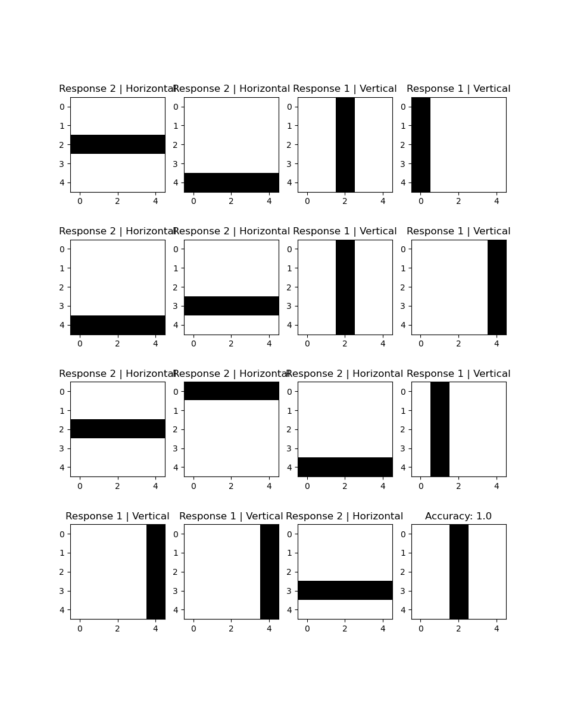
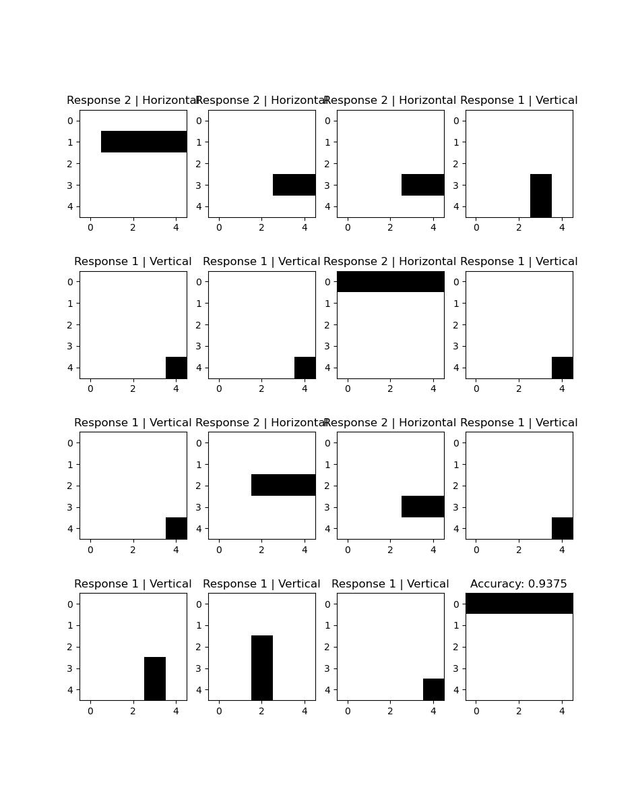

# HLine Vs VLine Perceptron Classifier

This project recreates the classic perceptron as a statistical separator for distinguishing between horizontal and vertical lines on a 5×5 grid.

**Note:** This is experimental code made to play around with the perceptron. The code base can have flaws or buggy code.

## Results

<div align="center">
  
  
  
  
</div>

## Usage

```bash
python main.py
```

The perceptron learns to classify vertical lines (Response 1) vs horizontal lines (Response 2) on a 5×5 stimulus grid.

## Architecture

- **Stimuli**: 5×5 grid input layer
- **A-units**: 50 associative units (25 per response class)
  - Each A-unit has excitatory (x) and inhibitory (y) connections
  - Initial values: 1 + random(0, 0.02)
- **Source Sets**: Two groups of A-units, one for each line orientation
- **Response Units**: Binary classifier output (vertical vs horizontal)
- **Threshold**: 2 (minimum excitatory-inhibitory difference to activate an A-unit)

## Training

The model uses a simple reinforcement learning approach:
- Correct predictions: reward active A-units in the correct source set, penalize incorrect ones
- Incorrect predictions: penalize active A-units in the wrong source set, reward correct ones

## Experiments

Full-length lines achieve ~100% accuracy with minimal training samples (~20 per class).

Irregular-length lines plateau around 85-93% accuracy, showing the task difficulty increases with partial patterns.

---

*A fun experiment with classical neural network concepts.*
